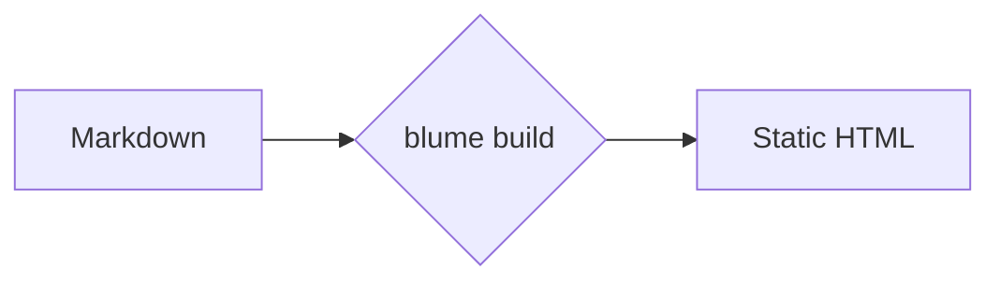

# Blume authoring reference

Scope: how to write Blume (`blume` 2.2.x) Markdown and MDX pages: syntax, code blocks, callouts, math, links, components, includes, variables, islands, and the `BLUME_*` diagnostics they raise.

## Contents

1. [.md vs .mdx](#md-vs-mdx)
2. [Headings and anchors](#headings-and-anchors)
3. [Inline formatting, lists, tables, quotes](#inline-formatting-lists-tables-quotes)
4. [Links and images](#links-and-images)
5. [Code blocks](#code-blocks)
6. [Package install, mermaid, math](#package-install-mermaid-math)
7. [Callouts](#callouts)
8. [Components](#components)
9. [Icons](#icons)
10. [Includes and partials](#includes-and-partials)
11. [Variables](#variables)
12. [Islands](#islands)
13. [Diagnostics index](#diagnostics-index)
14. [Gotchas](#gotchas)

## .md vs .mdx

Every page can be `.md` or `.mdx`. Components need no imports in `.mdx`.

| Feature | `.md` | `.mdx` |
| --- | --- | --- |
| Headings, emphasis, lists, tables, task lists, blockquote, code fences | yes | yes |
| `<kbd>`, superscript `^x^`, subscript `~x~`, smart punctuation | yes | yes |
| `:::note` directives | no (literal text, `BLUME_MD_DIRECTIVE`) | yes |
| GitHub alerts `> [!TIP]` | no (stays a quote, `BLUME_MD_GITHUB_ALERT`) | yes |
| Math `$$…$$` | no | yes |
| `mermaid` fences | no | yes |
| `package-install` fences | no (plain fence) | yes |
| `ts2js` fences | no (plain TS fence) | yes |
| Built-in components (`<Card>`, `<Tabs>`, ...) | no | yes |
| Islands, `<Component>` | no | yes |
| `{#custom-id}` heading anchor | accepted | page fails to compile (`BLUME_MDX_CURLY_ANCHOR`) |
| `[#custom-id]` heading anchor | yes | yes |
| Bare `{…}` | literal text | JSX expression (breaks on stray `{`) |

Rules for `.mdx`:
- Close void elements: `<br />`, ``. Unclosed ones raise `BLUME_MDX_UNCLOSED_ELEMENT`.
- Escape literal braces: `\{` `\}`.
- No HTML comments. Use `{/* … */}`.
- Event handlers on plain elements (`<button onClick={…}>`) never run. Use an island.

Components are vanilla and React-free. React switches on only when the project has a `.tsx`/`.jsx` file, a React island, a `<Component>` example, a component override, or the assistant is enabled.

## Headings and anchors

- Frontmatter `title` renders as the page heading. Start content at `##`.
- `##` and `###` become table of contents entries.
- A page without `title` uses its first `#` heading as the title. If the page opens with that heading it renders once, as the page heading, and keeps its anchor.
- Every `##`–`######` heading links to its own anchor. Disable with `markdown: { headingAnchors: false }` in `blume.config.ts`.
- Anchor ids come from heading text. Rewording a heading changes its anchor.
- `<Badge>` inside a heading is a label, not part of the id: `## Install <Badge>beta</Badge>` -> `#install`.
- An id never ends in a dash: `## Features ✨` -> `#features`.

### Pin an anchor

```md
## Getting started [#setup]
```

- Link as `/page#setup`. Syntax matches Fumadocs.
- The marker never renders. Id is used exactly as written (`[#read--write]` -> `#read--write`; no smart punctuation inside the marker).
- Pinned ids stay identical across translated locales.
- `{#custom-id}` (Pandoc/kramdown style) works in `.md` only, unspaced.
- These stay in the heading text and warn in `.md` as `BLUME_MD_CURLY_ANCHOR`: `{ #id }`, `{: #id }`, `{ #id .wide }`.
- In `.mdx`, `blume check` reports all three spellings as `BLUME_MDX_CURLY_ANCHOR`. Use `[#custom-id]`.
- Escaped form works in both formats and is right for partials that `.mdx` pages include:

```md
## Getting started \{#setup\}
```

- Fragment links can also target raw HTML ids: `<a id="setup"></a>` or `<a name="setup">`. `blume validate` accepts them.
- An empty `<a>` inside a heading (`## Getting started <a id="setup"></a>`) is lifted out and becomes the heading `id` (or `name`). A `[#custom-id]` marker on the same heading wins.

### Table of contents markers

| Marker | Effect |
| --- | --- |
| `[!toc]` | Heading on the page, hidden from the TOC |
| `[toc]` | Heading only in the TOC (invisible anchor target) |

```md
## Appears on the page only [!toc]

## Appears in the TOC only [toc]

## Both markers together [toc] [#custom-id]
```

- Markers chain in any order.
- Always parsed. Backslash escaping does not help. To show literal marker text at a heading end, wrap it in inline code: `` ## Using `[toc]` ``.
- Exception: if `[toc]: /url` is defined as a link reference anywhere on the page, the trailing bracket is a reference link, not a marker.

## Inline formatting, lists, tables, quotes

| Syntax | Result |
| --- | --- |
| `**Bold**`, `_italic_`, `~~strike~~`, `` `code` `` | standard |
| `<kbd>⌘</kbd> <kbd>K</kbd>` | bordered key badge (works inside `<Steps>`, `<Callout>`) |
| `E = mc^2^`, `H~2~O` | superscript, subscript |
| `> quote` | blockquote |
| `- [x] done` / `- [ ] todo` | task list |
| `"Quotes"`, `--`, `---`, `...` | curly quotes, en dash, em dash, ellipsis |
| `---` on its own line | horizontal rule |

Tables are GFM. Use colons in the divider row to align. For a headerless table (key-value), leave header cells empty; Blume drops the empty header:

```md
|                |          |
| -------------- | -------- |
| Current status | E-3 visa |
```

Smart punctuation applies to prose, not to the `[#id]` marker or to `<Prompt>` copied text (copies as typed).

## Links and images

### Links

- Relative page links (`./install`, `../guides/setup`) resolve from the page's own folder. On an index page, the folder it introduces.
- Link to a Markdown file (`./setup.md`, `../intro.mdx`) and it lands on the page that file publishes, `slug` included.
- Dotted page names (`./node.js` for `node.js.mdx`) count as page links when a page publishes there.
- Component string `href` resolves the same way: `<Card href="./install">`.
- Built output uses root-relative routes. `blume validate` checks them.
- Root-relative links to Markdown files (`/guides/setup.md`) resolve against the content root. Under a deployment `base`, a link starting with the base is read as including it. If no such file exists in content, the path is kept (it is also the URL of the page's Markdown copy).
- To link a page's Markdown copy regardless of file: raw `<a href="/guides/setup.md">` or the full URL.
- Link to a missing `.md` tries the other extension first (rename `setup.md` -> `setup.mdx` keeps `./setup.md` working). If neither exists, it falls back to a plain relative link with the extension dropped. That breaks on GitHub, so update extensions when renaming.
- Link to non-page files next to content (`[spec](./spec.pdf)`, `[spec]: ./spec.pdf`, `#page=2` suffix kept) publishes the file with the page. Same for `src` of ``, `<video>`, `<source>`, `<audio>` and `href` of `<a>` or components like `<Card>`. Copies are served as-is, no optimization.
- A relative link naming no file next to the page keeps its path (works for files under `public/`).
- External links open in the same tab by default. `markdown: { externalLinks: true }` gives absolute `https://` / `//host` links `target="_blank"`, `rel="noreferrer"`, an arrow, and a screen-reader note. Own pages, `#fragments`, `mailto:`, `tel:`, and raw `<a>` tags are left alone.

### Images

| Form | Behavior |
| --- | --- |
| `` (relative, next to page or in a shared content folder) | Optimized at build: compressed, WebP, intrinsic `width`/`height` |
| `` (absolute, under `public/`) | Served verbatim, no optimization |
| Remote URL | Passed through untouched unless host is authorized in the `image` config |

- Prefer relative paths.
- Click-to-zoom lightbox is on by default. Off globally: `markdown: { imageZoom: false }`. Off per image: `data-no-zoom`.
- An SVG whose size Astro cannot read (needs width/height or viewBox on `<svg>`, ending within the first 1,000 bytes; draw.io exports with a `content` attribute fail this) is served as-is and warns `BLUME_SVG_UNOPTIMIZED` at the embedding line. Fix: export without the source copy or remove the `content` attribute.

## Code blocks

Fences are Shiki-highlighted, with a header (language label, brand icon for known languages) and a copy button.

### Title

Words after the language become the header title (replacing the language label).

````md
```ts blume.config.ts
```
````

| Spelling | Result |
| --- | --- |
| ` ```js Install the client ` | title "Install the client" (every word after the language) |
| ` ```ts title="app.js" ` | explicit title |
| ` ```ts [blume.config.ts] ` | title without brackets |
| ` ```ts [blume.config.ts]{2} ` | title plus line highlight |

Not part of the title: keywords (`lineNumbers`, `wrap`, `expandable`, `twoslash`, `ts2js`), ranges `{1,4-5}`, `key="value"` options.

### Language

- Any Shiki language id or alias, any case (` ```JSON ` = ` ```json `).
- Unknown language renders plain text and warns `BLUME_UNKNOWN_CODE_LANGUAGE`. Write `text` for intentionally plain blocks.

### Fence options

| Option | Effect |
| --- | --- |
| `lineNumbers` | Line-number gutter |
| `wrap` | Wrap long lines in this block (all blocks: `markdown.code.wrap`) |
| `expandable` | Show first lines with a "Show more" toggle. Blocks under 16 lines render normally. |
| `{1,4-5}` | Highlight lines by number (single, comma list, `start-end`). Space optional: ` ```ts{1,4-5} ` |
| `twoslash` | TS only. Real compiler types on hover; `//     ^?` query pins a type below the line |
| `ts2js` | MDX only. `ts`/`tsx` block renders as TypeScript + auto-generated JavaScript tabs |
| `title="…"` | Explicit title |

Combinations: `wrap`, `expandable`, title, and `lineNumbers` compose.

`ts2js` details:
- Strips type syntax and type-only imports; keeps formatting, comments, JSX.
- Tabs sync across the page (pick JavaScript once, all pairs switch).
- `title="..."` shows on both tabs. `{1,4-5}` ranges apply to the TypeScript tab only.
- `twoslash` + `ts2js` on one fence: stays a plain Twoslash block.
- In `.md` it renders as a plain TS fence.

### Unsupported fence options (warn `BLUME_CODE_FENCE_OPTION`)

| Other tool's option | Use instead |
| --- | --- |
| `hl_lines="2 3"` (MkDocs) | `{2,3}` |
| `linenums="1"` (MkDocs) | `lineNumbers` |
| `showLineNumbers` | `lineNumbers` |
| `lines` (Mintlify) | `lineNumbers` |
| `wordWrap` (Fern) | `wrap` |
| `filename="app.js"` | `title="app.js"` |
| Rust `ignore`, `no_run`, `should_panic`, `compile_fail`, `edition2015`..`edition2024`, `noplayground`, `editable` | remove them (Blume never compiles or runs code) |

None of them become part of the title.

### Inline comment annotations

On by default. Comments are stripped from output (copy stays clean).

| Comment | Effect |
| --- | --- |
| `// [!code highlight]` | Highlight the line |
| `// [!code ++]` | Diff add (green) |
| `// [!code --]` | Diff remove (red) |
| `// [!code word:createServer]` | Highlight every occurrence of the term on the line |
| `// [!code error]` | Red tint |
| `// [!code warning]` | Amber tint |
| `// [!code focus]` | Dim everything except marked lines (sharpens on hover) |

```ts
export default defineConfig({
  title: "My docs", // [!code --]
  title: "Blume docs", // [!code ++]
});
```

### Console sessions

A `console` or `shellsession` fence is a terminal session. Commands follow a prompt like `$`; output follows. The copy button copies only commands without prompts. A command ending in `\` keeps its continuation lines.

````md
```console
$ bun add blume
added 1 package in 2s
$ bunx blume dev
```
````

### Inline code highlighting

Add a `{:lang}` marker inside a backtick span: `` `useState(){:js}` ``, `` `T extends object{:ts}` ``. Without the marker, inline code is untouched.

### Themes

Default `github-light` / `github-dark`. Set per color mode; applies to fences, inline snippets, `<CodeBlock>`, and `<Diff>`:

```ts
export default defineConfig({
  markdown: {
    code: {
      theme: { light: "github-light", dark: "vesper" },
    },
  },
});
```

- Custom Shiki theme definitions work: import a VS Code-compatible JSON (use `with { type: "json" }` when the runtime needs it) and assign to either mode. Bundled names and custom definitions can mix.
- Other `markdown.code` options named in the docs: `icons: false` (hide language icons), `wrap: true` (wrap every block).

## Package install, mermaid, math

### package-install (MDX only)

One install command becomes a tabbed snippet for npm, pnpm, yarn, bun, nub, and aube.

````md
```package-install
npm i blume
```
````

Write the single command as an npm command. In `.md` it renders as a plain fence.

### Mermaid (MDX only)

Fence with `mermaid`. Contents go to Mermaid verbatim, so every Mermaid diagram type works (flowchart, sequenceDiagram, classDiagram, stateDiagram-v2, erDiagram, journey, gantt, gitGraph, pie, mindmap, timeline, ...).

````md

````

- Renders client-side; Mermaid loads only on pages with a diagram. Follows the active theme.
- Default layout dagre, classic look. Per diagram, use Mermaid front matter `config:` with `layout: elk` or `look: neo` (ELK loads only when asked).
- On parse failure the page shows "Could not render this diagram."; the parser error (with line) goes to the browser console, and `blume dev` also prints it.

### Math (MDX only)

KaTeX. Both block and inline use two dollar signs.

```md
$$
a^2 + b^2 = c^2
$$

Euler: $$e^{i\pi} + 1 = 0$$.
```

- On automatically. No math -> KaTeX stylesheet never ships.
- A single `$` is always literal ("$5 and $10" is safe). Nothing to escape or toggle.
- KaTeX class names (`.katex-html`, `.katex-base`) are not a styling contract. Target `.katex-display` for custom styles.

## Callouts

MDX only. Write `:::type`, optional title in brackets: `:::warning[Heads up]`. The title keeps inline formatting (code, emphasis, links).

```md
:::warning[Heads up]
Server output needs a host adapter from `blume/deploy`.
:::
```

| Type | Use |
| --- | --- |
| `note` | Neutral supporting context |
| `tip` | Helpful, optional advice |
| `success` | Positive outcome, step completed |
| `warning` | Needs care |
| `danger` | Destructive or breaking, hard to undo |
| `info` | Informational aside, reads neutral |

Aliases: `caution` -> `warning`, `error` -> `danger`, `important` -> `note`, `warn` -> `warning`.

Nesting: give the outer callout a longer fence.

```md
::::note
Outer.

:::tip
Inner.
:::
::::
```

Spacing and text rules:
- Name goes right after the colons. `::: tip` (with space) is not a directive: shows as text, warns `BLUME_DIRECTIVE_SPACED_NAME`.
- `:::tip Some title` opens the callout but the text never shows: warns `BLUME_DIRECTIVE_OPENING_TEXT`. Use `:::tip[Some title]`.
- Inside a container, a closing fence with text (`::: card` inside `:::warning`) closes the callout and drops the text: warns `BLUME_DIRECTIVE_CLOSING_TEXT`. Fix: longer outer fence, or remove the text after the colons.
- An unknown name (`:::details`, `:::warnig`) is not a callout. Content still renders between the literal `:::` lines. Warns `BLUME_UNKNOWN_DIRECTIVE`.
- Directive in a `.md` file stays literal; warns `BLUME_MD_DIRECTIVE`. Rename to `.mdx`.

### GitHub alerts

MDX only. A quote whose first line is `[!NOTE]`, `[!TIP]`, `[!IMPORTANT]`, `[!WARNING]`, or `[!CAUTION]` (any case) renders as a callout. Text after the marker on that line is the title.

```md
> [!TIP]
> Set `deployment.site` so sitemaps use absolute URLs.
```

| Alert | Renders as |
| --- | --- |
| `[!NOTE]` | note |
| `[!TIP]` | tip |
| `[!IMPORTANT]` | note |
| `[!WARNING]` | warning |
| `[!CAUTION]` | danger |

- Other markers (`[!INFO]`) stay a quote. An alert quoted inside another stays a quote.
- A line-joining formatter (oxfmt with `proseWrap: "never"`) pulls the first body line beside the marker, where it becomes the title. Leave a blank `>` line after the marker.
- In `.md`: stays a quote, warns `BLUME_MD_GITHUB_ALERT`.

## Components

Available in any `.mdx` page with no imports. A component ignores props it does not take. A childless component given props it does not take warns `BLUME_UNKNOWN_PROP` listing the valid props. Example: VitePress `<Badge type="tip" text="beta" />` renders nothing; write `<Badge>beta</Badge>`.

### Card, CardGroup

| Component | Prop | Notes |
| --- | --- | --- |
| `CardGroup` | `cols` | default `2` |
| `Card` | `title` | |
| | `href` | optional; omit for non-clickable |
| | `icon` | Lucide icon name |
| | `img` | file next to page (`./cover.png`), path under `public/`, or URL; across the top (beside text from `sm` up with `horizontal`) |
| | `horizontal` | image beside text |
| | `cta` | call-to-action line in accent color |
| | `arrow` | arrow after title and CTA; shown by default only for external links |
| | `type` | tints card and picks matching icon: `note`, `info`, `tip`, `check`, `warning`, `danger` |
| | `color` | any CSS color for the icon |

```mdx
<CardGroup cols={2}>
  <Card title="Quickstart" href="/docs/quickstart" icon="rocket">
    Install Blume and ship your first page.
  </Card>
</CardGroup>
```

### Steps

`Steps` prop: `titleSize` (`p` default, `h4`, `h3`, `h2`). `Step` props: `title`, `icon` (replaces the number in the marker).

```mdx
<Steps>
  <Step title="Install Blume">Add the package.</Step>
  <Step title="Ship it">Run `blume build`.</Step>
</Steps>
```

### Tabs, Tab

`Tab` props: `title`, `icon` (before the title).

| `Tabs` prop | Effect |
| --- | --- |
| `inline` | Borderless strip on a full-width rule; content flows as prose |
| `param="install"` | Sync active tab to a URL query param (not hash); shareable (`?install=windows`). Each group syncs to its own param. |
| `syncKey` | Scope title-based syncing to groups sharing the key |
| `sync={false}` | Keep this group out of syncing |
| `hash={false}` | Do not write the active tab to the URL hash (default: written) |
| `defaultTabIndex` | First open tab, zero-based, default `0` (used when no link or sync chooses one) |
| `dropdown` | Select menu instead of tab strip (boxed layout only) |
| `borderBottom={false}` | Drop the rule under the strip |

- Groups with same-titled tabs switch together by default.

```mdx
<Tabs inline param="install">
  <Tab title="macOS">Use Homebrew.</Tab>
  <Tab title="Windows">Use winget.</Tab>
</Tabs>
```

### View

Page-wide audience picker. Each distinct `title` becomes an option above the content; only the chosen view's blocks show.

| Prop | Effect |
| --- | --- |
| `title` | Option name; blocks sharing a title show/hide together |
| `icon` | Icon beside the name in the picker |

- Prose outside any `<View>` shows in every view. TOC drops headings inside hidden views.
- First view shows until the reader picks another. Pick is remembered across pages written in views and written to the URL as `?view=Python`. A link to a heading inside a view opens that view.
- Agent-facing Markdown includes every view, each under its name.
- Use `<View>` when most of the page changes; use `Tabs` when one part does.
- Put a blank line after `<View …>` and before `</View>` so Markdown inside parses.

````mdx
<View title="JavaScript" icon="braces">

## Install the client

```bash
bun add @acme/commerce
```

</View>

<View title="Python" icon="terminal">

## Install the client

```bash
pip install acme-commerce
```

</View>
````

### Callout (component)

Component behind directives (`:::warning[Heads up]` = `<Callout type="warning" title="Heads up">`). Use it when you need a custom icon or color.

| Prop | Notes |
| --- | --- |
| `type` | `note`, `info` (default), `tip`, `success` (or `check`), `warning`, `danger`. Aliases `caution`, `error`, `important`, `warn` work only in `:::` form. |
| `title` | Bold first line |
| `icon` | Replaces the type's icon. Same inputs as `<Icon>`: Lucide name, image path/URL, inline SVG |
| `color` | Any CSS color; replaces tint (border, icon, body text over page background) |

```mdx
<Callout type="tip" title="Ship it" icon="rocket">
  Run `blume build` before you deploy.
</Callout>
```

### Badge

Inline label. Content is children.

| Prop | Values |
| --- | --- |
| `variant` | default (omit), `accent`, `success`, `warning`, `danger` |
| `color` | `blue`, `green`, `orange`, `purple`, `red`, `teal`, `violet`, `yellow`; neutrals `gray`, `surface`, `white`, `surface-destructive`, `white-destructive`; or a hex value |
| `shape` | `rounded` (default), `pill` |
| `size` | `xs`, `sm`, `md` (default), `lg` |
| `stroke` | outline instead of fill |
| `icon` | icon before the label |
| `tooltip` | hover text |
| `disabled` | dim it |

```mdx
<Badge color="purple" icon="sparkles" shape="pill" stroke>Preview</Badge>
```

### Icon

See [Icons](#icons).

### FileTree

Wrap a normal Markdown list; leave blank lines inside the tags.

```mdx
<FileTree>

- docs/
  - index.mdx
  - guides/
    - configuration.mdx
- blume.config.ts

</FileTree>
```

### Tree (per-folder control)

| Component | Props |
| --- | --- |
| `Tree` | wrapper |
| `Tree.Folder` | `name`, `defaultOpen`, `openable` |
| `Tree.File` | `name` |

```mdx
<Tree>
  <Tree.Folder name="src" defaultOpen>
    <Tree.File name="index.ts" />
  </Tree.Folder>
  <Tree.File name="blume.config.ts" />
</Tree>
```

### Accordion, AccordionItem

`AccordionItem` props: `title`, `icon`, `description`, `defaultOpen`. `title` renders inline Markdown (code, emphasis, links); raw HTML in it shows as text. For a single standalone disclosure use `Expandable`.

```mdx
<Accordion>
  <AccordionItem title="Does it support MDX?">Yes.</AccordionItem>
</Accordion>
```

### Expandable

Props: `title` (default "Show more"; inline Markdown), `defaultOpen`.

### Columns, Column

`Columns` prop: `cols`. Wrap each cell in `Column`. Reflows on mobile.

### CodeGroup

Tabbed switcher over code fences. Tab label = block title, else the language name (`TypeScript`, `Python`). Copy button sits in the tab bar and copies the visible block. Prop: `dropdown` (menu instead of tab bar). Leave blank lines between tags and fences.

````mdx
<CodeGroup>

```ts TypeScript
export const greet = (name: string) => `Hello, ${name}`;
```

```python Python
def greet(name: str) -> str:
    return f"Hello, {name}"
```

</CodeGroup>
````

### Frame

Centered bordered frame. Props: `caption` (rendered as Markdown), `hint`.

```mdx
<Frame caption="A **framed** illustration." hint="Frames center and caption visuals.">
  
</Frame>
```

### YouTube

Privacy-friendly (`youtube-nocookie.com`) 16:9, no client JS.

| Prop | Notes |
| --- | --- |
| `id` | video id |
| `url` | full URL; a playlist URL (`youtube.com/playlist?list=…` or `youtube.com/embed/videoseries?list=…`) embeds the playlist |
| `title` | for accessibility |
| `start` | start time in seconds |

```mdx
<YouTube id="aqz-KE-bpKQ" title="Big Buck Bunny" />
<YouTube url="https://youtu.be/aqz-KE-bpKQ" start={30} />
```

### Color

| Component | Props |
| --- | --- |
| `Color` | `variant="compact"` (swatch list) or `variant="table"` (group with `Color.Row`) |
| `Color.Row` | groups items in table variant |
| `Color.Item` | `name`, `value` (hex string, or `{ light, dark }` for theme-aware; copies the value for the current theme) |

```mdx
<Color variant="compact">
  <Color.Item name="blue-500" value="#3B82F6" />
  <Color.Item name="background" value={{ light: "#FFFFFF", dark: "#0A0A0A" }} />
</Color>
```

### Panel

Titled container. Prop: `title` (optional).

### Tooltip

Inline hover hint. Props: `tip` (hover text), `headline` (optional), `cta` + `href` (optional follow-up link). Children are the trigger term.

```mdx
<Tooltip tip="A set of protocols." headline="API" cta="Read the guide" href="/docs/quickstart">API</Tooltip>
```

### Tile

Clickable preview leading with a visual. Props: `title`, `description`, `href`. Child is the visual.

```mdx
<Tile title="Quickstart" description="Ship your first page." href="/docs/quickstart">
  <Icon icon="rocket" size={28} />
</Tile>
```

### Prompt

One row with a label and copy button. `description` (Markdown) is the visible label. The body is the hidden prompt, copied as Markdown (links, lists, code intact) when **Copy prompt** is pressed. Punctuation copies as typed (straight quotes, `--`, `...`).

| Prop | Notes |
| --- | --- |
| `description` | visible label (Markdown) |
| `actions` | buttons, e.g. `["copy", "cursor"]` |

### Visibility

| Prop | Effect |
| --- | --- |
| `for="web"` | Renders only on the site; omitted from agent Markdown |
| `for="agents"` | Only in agent-facing Markdown (`llms-full.txt` and each page's `.md` mirror) |

### TypeTable

Prop/Type grid; each row expands to details. `type` is a map keyed by property name.

| Entry key | Notes |
| --- | --- |
| `type` | type string |
| `description` | |
| `default` | |
| `required` | flag; unset shows `?` after the name |
| `typeDescription` | |
| `typeDescriptionLink` | |

```mdx
<TypeTable
  type={{
    label: { type: "string", required: true, description: "Visible label." },
    variant: { type: '"primary" | "ghost"', default: '"primary"' },
    disabled: { type: "boolean" },
  }}
/>
```

### AutoTypeTable

Generates a table from a TypeScript interface/type alias. Descriptions from JSDoc, defaults from `@default`, optional props marked.

| Prop | Notes |
| --- | --- |
| `path` | file, resolved from project root (folder you run `blume` in) |
| `name` | type name |
| `type` | inline type source string instead of `path` |

```mdx
<AutoTypeTable path="./src/button.ts" name="ButtonProps" />
```

### API fields

Hand-written endpoint docs, styled like the generated OpenAPI reference. Same names/props as Mintlify's.

| Component | Props |
| --- | --- |
| `ParamField` | exactly one location attribute: `path`, `query`, `header`, or `body` (value = param name); plus `type`, `required`, `deprecated`, `default`; description as content |
| `ResponseField` | `name`, `type`, `required`, `deprecated`, `default`, `pre`, `post` (label arrays around the name, e.g. `post={["beta"]}`); description as content |

```mdx
<ParamField path="userId" type="string" required>The user's ID.</ParamField>
<ParamField query="limit" type="integer" default={20}>How many results.</ParamField>
<ResponseField name="plan" type="string" post={["beta"]}>The user's plan.</ResponseField>
```

- Nest an object's fields with `<Expandable title="properties">` containing more `ResponseField`s.
- On pages with `api` frontmatter, `ParamField`s also build the Try it panel and request samples.
- The Markdown copy lists each field with type and flags.

### RequestExample, ResponseExample

Hold code fences, one tab per titled fence. Prop: `dropdown` (language menu). On wide screens they pin to a column beside the page (request above response) and the page drops its TOC. On narrow screens they follow content. Write them at the top level of the page; nested inside another component (e.g. `Tab`) they stay in place.

````mdx
<RequestExample>

```bash cURL
curl --request POST https://api.acme.dev/v1/users
```

</RequestExample>

<ResponseExample>

```json 201
{ "id": "usr_8f2k", "status": "invited" }
```

</ResponseExample>
````

### GithubInfo

Repo card with star/fork counts fetched at build time (no client JS; renders without counts if the API is unreachable).

| Prop | Notes |
| --- | --- |
| `owner`, `repo` | omit both to use the repository from `blume.config` |
| `host` | point one card at another instance (e.g. `https://github.com`); default reads `github.host` |
| `token` | overrides `GITHUB_TOKEN` for one card; prefer the env var |

Set `GITHUB_TOKEN` to lift the API rate limit.

### Component (live examples)

Renders a file from the project `examples/` directory as live preview + highlighted source, in tabs. Supports React, Vue, Svelte, Astro (framework examples hydrate; Astro renders statically).

```mdx
<Component path="counter" />
```

- `path` = location under `examples/` without extension (`examples/counter.tsx` -> `path="counter"`).
- A `path` that matches nothing renders a "No example found" box and warns `BLUME_EXAMPLE_NOT_FOUND` (from `blume dev`, `blume build`, `blume doctor`).
- Preview renders in an isolated frame: Tailwind (preflight + utilities scanned from project and examples dir), Blume design tokens (`bg-background` follows the palette), live light/dark sync. Height tracks the example; Preview and Code tabs share one height.
- Custom preview styles: `examples.css` in `blume.config.ts`, injected after Blume defaults. Do not `@import "tailwindcss"` in it. Both `.dark` and `[data-theme="dark"]` work.

```ts
export default defineConfig({
  examples: { css: "examples/theme.css" },
});
```

- Different directory: `examples: { source: "…" }` or string shorthand `examples: "registry/files-sdk"`. `path` stays relative to it.
- `examples` can be a glob (anything with `*`, `?`, `[]`, `{}`, `!`). Only matching files are discovered; `path` is relative to the glob's static prefix. Example: `examples: "registry/files-sdk/**/examples/*"` with `<Component path="file-list/examples/basic" />`.
- Monorepo: Tailwind scans files, not imports. For classes used only in a sibling package, add `@source "../../../packages/ui/src";` (relative to the file) in `examples.css` (preview frames) or `theme.css` (site).

### CodeBlock

Highlights a code string with the same Shiki theme and transformers as fences, for places a fence can't go.

```astro
---
import CodeBlock from "blume/components/content/CodeBlock.astro";
---

<CodeBlock lang="ts" code={source} />
```

| Prop | Notes |
| --- | --- |
| `code` | source string |
| `lang` | language |
| `title` | header label (default: language) |
| `icons={false}` | hide brand icon (like `markdown.code.icons`) |

- Without `code`, children render as written, so a fence wrapped in `<CodeBlock>` shows as that fence. `title` and other props do not apply then; put the title after the language on the fence.
- HTML string helper: `import { highlightCode } from "blume/markdown"; const html = await highlightCode(source, "ts");`

### Diff

Git-style diff, Shiki-highlighted, built at build time, no client JS. Choose one input form:

| Input | Props |
| --- | --- |
| Two strings | `old`, `new` |
| Two files (relative to project root) | `before`, `after` |
| Unified patch, inline | `patch` |
| Unified patch, file | `src` |

Also takes `lang`.

```mdx
<Diff lang="ts" old={`const a = 1;`} new={`const a = 2;`} />
<Diff before="diffs/button-before.ts" after="diffs/button-after.ts" />
<Diff src="diffs/greet.patch" />
```

## Icons

- Render with `<Icon icon="rocket" size={20} />`. The same `icon` prop powers `Card`, `Step`, `Tab`, `AccordionItem`, `Badge`, `View`, `Callout`, and sidebar entries.
- Names are Lucide: lowercase kebab-case (`rocket`, `gauge`, `book-open`). Blume is Lucide-only. `lucide:rocket` prefix is accepted.
- Instead of a name you can pass a raw `<svg>` string, an image URL, or a local image path.

| `Icon` prop | Default | Notes |
| --- | --- | --- |
| `icon` | | name, SVG string, URL, or local path |
| `size` | `16` | pixels |
| `color` | `currentColor` | any CSS color |
| `label` | none | exposes to assistive tech; without it the icon is decorative |

Icons resolve at build time and inline as zero-JS SVG.

## Includes and partials

Embed another file at build time, as if written inline. Headings join the TOC, text is indexed by search, content appears in the page's `.md` mirror and `llms-full.txt`.

```mdx
<include>./_snippets/prerequisites.mdx</include>
<include>/_snippets/prerequisites.mdx</include>
```

- Path resolves relative to the including file. A leading `/` resolves from the content root.
- Fumadocs-compatible syntax.
- A statement a formatter wraps across lines still splices. One Blume cannot parse warns `BLUME_INCLUDE_MALFORMED` at its line.
- The statement must occupy its own line (block-level, not inline). Statements inside fenced code are left alone.
- Targets must live inside the content root.

### Partials

Files or folders starting with `_` are excluded from routing, navigation, search, and sitemaps. Patterns in `content.exclude` add to this rule. To publish underscore files, add `"!**/_*"` to `exclude`.

```text
docs/
  _snippets/
    prerequisites.mdx
  guides/
    quickstart.mdx   <- <include>../_snippets/prerequisites.mdx</include>
```

- A partial is a normal `.md`/`.mdx` file. Its front matter is stripped (the including page's wins). Callouts, fences, components, math render as inline.
- Partials can include partials. Cycles are errors.
- Link reference definitions cross includes both ways. If page and partial define the same label, each uses its own.
- Relative image refs in a partial are rebased onto the including page (angle brackets, escaped parentheses, quoted titles all work). Links to non-page files next to the partial (`[spec](./spec.pdf)`, ``, `<a href>`) move with it. Links to pages resolve from the including page.
- Editing a partial in `blume dev` reloads every page that includes it.
- A partial is read in the including page's format. A `.md` partial included from `.mdx` is read as MDX: `<!-- … -->` comments are spliced as `{/* … */}`; other HTML must be valid JSX (`<br />`).
- Partials are shared across locales and not translated by `blume translate`. Keep them language-neutral (code, tables, diagrams) or create per-locale partials.

### Props

Pass values as attributes; read them with `{{name}}` in the partial.

```mdx
{/* docs/_snippets/upgrade.mdx */}
Upgrade to the **{{plan}}** plan to use {{feature}}.
```

```mdx
<include plan="Enterprise" feature="SSO">
  ./_snippets/upgrade.mdx
</include>
```

- Every attribute except `lang` and `meta` is a prop. Names are lowercase. Values are quoted plain text.
- A prop applies to the included file and anything it includes, and beats a site-wide variable of the same name.
- Props reach Markdown/MDX partials only. `{{name}}` in an included code file is not replaced.

### Including code files

A target that is not `.md`/`.mdx` embeds as a fenced code block; language inferred from the extension.

| Attribute | Effect |
| --- | --- |
| `lang` | Override language, or show a Markdown file as source instead of splicing |
| `meta` | Fence meta string, e.g. a title |

```mdx
<include>./examples/config.ts</include>
<include meta='title="config.ts"'>./examples/config.ts</include>
<include lang="mdx">./_snippets/prerequisites.mdx</include>
```

### Include diagnostics

| Code | Cause | Fix |
| --- | --- | --- |
| `BLUME_INCLUDE_OUTSIDE_ROOT` | Target outside the content root | Move the file inside the content root |
| `BLUME_INCLUDE_NOT_FOUND` | Target does not exist | Fix the path |
| `BLUME_INCLUDE_CYCLE` | Includes loop | Break the loop |
| `BLUME_INCLUDE_MALFORMED` | Unparseable statement (warning) | Rewrite as `<include>path</include>` on its own line |
| `BLUME_MDX_UNCLOSED_ELEMENT` | Unclosed void element in partial; swallows everything after it, no error | `<br />` |
| `BLUME_MDX_SYNTAX` | Partial has something MDX cannot parse once spliced (stray `{`) | Fix at the partial's line |

The first three fail `blume build` (pass `--no-strict` to build anyway) and appear in `blume validate`. Broken links in a partial are reported against the partial file.

## Variables

Define in `blume.config.ts`; read with `{{name}}`.

```ts
export default defineConfig({
  variables: {
    version: "2.1.0",
    "api-url": "https://api.example.com",
  },
});
```

```mdx
Install version {{version}}, then call {{api-url}}.

## What's new in {{version}}

<Card title="Release {{version}}" href="{{api-url}}/changelog" />
```

- Works in prose, headings, links, code blocks, inline code, and component props; in `.md` and `.mdx`, and in included files. Spaces in braces are fine (`{{ version }}`).
- Names: letters, digits, `_`, `-`. Values: plain text, one line.
- Replacement happens before anything reads the page: HTML, search, `.md` mirror, `llms-full.txt` all show the value.
- Front matter is not replaced: `{{version}}` in `title`/`description` shows the braces.
- Include props override variables of the same name.

### Undefined names

| Where | Result |
| --- | --- |
| Prose (site has variables) | build error `BLUME_UNDEFINED_VARIABLE` at its line |
| Code block or inline code | left as written (Handlebars-style examples are safe) |
| `.md` page on a site that defines no variables | `{{…}}` stays as written |
| `.mdx` page, undefined `{{name}}` | page fails to render: `BLUME_MDX_UNDEFINED_NAME` at its line. Escape both opening braces (`\{\{name}}`) or use inline code |
| `.md` page, `{{ site.title }}` or `{{ page.url \| relative_url }}` (more than a name) | never a variable; warns `BLUME_TEMPLATE_TAG` |

To show a reference literally in prose: `` `{{name}}` ``.

## Islands

Pages are static HTML with zero JS. An island is a framework component that ships JS only for itself, only on pages that use it.

### islands/ convention

Put a component in `islands/` at the project root. The filename is the component name; use it in any `.mdx` page with no import.

```tsx
// islands/Counter.tsx
import { useState } from "react";

export default function Counter() {
  const [count, setCount] = useState(0);
  return <button onClick={() => setCount(count + 1)}>Clicked {count}</button>;
}
```

```mdx
Here's a live counter: <Counter />
```

- Filename must be a PascalCase identifier: letters, digits, underscores only. Lowercase names and names with dashes/dots/spaces (`Time-Picker.tsx`) are skipped with a build warning.
- Two islands with the same name (`Counter.tsx` and `Counter.vue`, or same name in different subfolders): the first by file path wins; the other is ignored with a build warning.
- Props passed in MDX (`<Counter start={5} />`) are forwarded. Children (`<Counter>label</Counter>`) arrive as the default slot.
- Props must be serializable (strings, numbers, plain objects). No functions.
- Static reusable components with no interactivity belong in an MDX override (Customization), not an island: it ships no JS.
- Event handlers on plain MDX elements never run (`BLUME_MDX_EVENT_HANDLER`). Move the markup into an island.

### Register in components.ts

Alternative to the folder: register as an `mdx` entry with a `client` mode via `defineComponents`. An entry with the same name as an `islands/` file replaces it.

```ts
import { defineComponents } from "blume";
import Counter from "./widgets/Counter.tsx";

export default defineComponents({
  mdx: {
    Counter: { component: Counter, client: "visible" },
    Chart: { component: "./widgets/Chart.tsx", client: "only" },
  },
});
```

- `component` is an imported component or a path string. Pick `client` per island. `"media"` takes a `media` query alongside.
- No default here: an `mdx` entry without `client` renders as static HTML. Blume warns when that entry is a React, Vue, or Svelte component.
- `components.ts` is read statically. An entry must be an imported component, a path string, or a `{ component, client, media }` object literal.

### Hydration

Default is `client:visible`. Override in the island file with `export const client = "…"`.

```tsx
// islands/Chart.tsx
export const client = "only";

export default function Chart() {
  /* ... */
}
```

| `client` | Hydrates | Use for |
| --- | --- | --- |
| `"visible"` (default) | When scrolled into view | Most islands |
| `"load"` | Immediately on page load | Above-the-fold, must-be-instant UI |
| `"idle"` | When the main thread is idle | Non-urgent interactivity |
| `"only"` | Client only, never server-rendered | Libraries needing `window`/`document` (charts, editors) |
| `"media"` (`components.ts` only) | When a CSS media query matches | Size-specific UI, e.g. mobile-only menu |

`"media"` example: `{ component: Menu, client: "media", media: "(max-width: 50em)" }`. An `islands/` file that declares `"media"` falls back to `"visible"` with a warning.

### Frameworks

- React: works out of the box; turns on automatically when the project has a `.tsx`/`.jsx` island.
- React Compiler: on by default whenever React is enabled (auto-memoization; ships with Blume, nothing to install). Opt out:

```ts
export default defineConfig({
  react: { compiler: false },
});
```

- Vue and Svelte: install the Astro integration and Blume wires the renderer when it sees a `.vue` or `.svelte` island.

```bash
# Vue
bun add @astrojs/vue vue

# Svelte
bun add @astrojs/svelte svelte
```

### Hooks (`blume/hooks`)

Islands have no shared React context. The layout serializes a snapshot; hooks read it.

| Hook | Returns |
| --- | --- |
| `useBlume()` | `{ config, navigation }`, or `null` before mount |
| `usePage()` | `{ route, title }`, or `null` before mount |
| `useSearch()` | `{ search, results, loading }` (queries the configured search provider) |
| `useAssistant()` | `{ ask, messages, loading, reset }` (streams from the assistant endpoint) |

```tsx
import { useBlume, usePage } from "blume/hooks";

export default function PageInfo() {
  const blume = useBlume();
  const page = usePage();
  if (!(blume && page)) {
    return null;
  }
  return <p>You're reading <strong>{page.title}</strong> on {blume.config.title}.</p>;
}
```

- Guard for `null` from `useBlume()` / `usePage()` so server and client first frames match.
- The snapshot is emitted only on pages that ship React.
- On custom pages built with `PageLayout`, pass `clientData` so islands can read it:

```astro
<PageLayout
  clientData={{ config: data.config, navigation: data.navigation, page: { route: "/", title: "Home" } }}
/>
```

## Diagnostics index

All are reported by `blume dev`, `blume build`, and `blume check` unless noted. Syntax-from-other-tools rules skip code blocks, inline code, and comments; wrap an example in inline code to show it as text.

| Code | Severity / where | Cause | Fix |
| --- | --- | --- | --- |
| `BLUME_MD_DIRECTIVE` | warn, `.md` | `:::note` in `.md` stays literal | Rename page to `.mdx` |
| `BLUME_MD_GITHUB_ALERT` | warn, `.md` | `> [!TIP]` stays a quote | Rename page to `.mdx` |
| `BLUME_UNKNOWN_DIRECTIVE` | warn | `:::name` is not a callout type | Use note, tip, success, warning, danger, info (or aliases). Content still renders between literal `:::` lines |
| `BLUME_DIRECTIVE_SPACED_NAME` | warn | `::: tip` (space after colons) | `:::tip` |
| `BLUME_DIRECTIVE_OPENING_TEXT` | warn | `:::tip Some title` (text never shows) | `:::tip[Some title]` |
| `BLUME_DIRECTIVE_CLOSING_TEXT` | warn | closing fence with text inside a container (`::: card` inside `:::warning`) closes it and drops the text | Longer outer fence, or remove the text |
| `BLUME_MD_CURLY_ANCHOR` | warn, `.md` | `{ #id }`, `{: #id }`, `{ #id .wide }` stay in heading text | `[#id]` or unspaced `{#id}` |
| `BLUME_MDX_CURLY_ANCHOR` | `.mdx` compile failure | any `{#id}` spelling in a heading | `[#id]` or `\{#id\}` |
| `BLUME_UNKNOWN_CODE_LANGUAGE` | warn | Fence language unknown to Shiki; renders plain | Valid Shiki id, or `text` |
| `BLUME_CODE_FENCE_OPTION` | warn | Option from another tool does nothing | Use the spelling in the table under Code blocks |
| `BLUME_SVG_UNOPTIMIZED` | warn | SVG size unreadable by Astro; served as-is | Export without source copy / remove `content` attribute on `<svg>` |
| `BLUME_UNKNOWN_PROP` | warn | Childless component given props it does not take | Pass content as children; use listed props |
| `BLUME_EXAMPLE_NOT_FOUND` | warn (also `blume doctor`) | `<Component path>` matches no example | Fix `path` or add the file under `examples/` |
| `BLUME_INCLUDE_MALFORMED` | warn | Unparseable include statement | Rewrite correctly on its own line |
| `BLUME_INCLUDE_OUTSIDE_ROOT` | error | Include target outside content root | Move file inside the content root |
| `BLUME_INCLUDE_NOT_FOUND` | error | Include target missing | Fix path |
| `BLUME_INCLUDE_CYCLE` | error | Circular include | Break the cycle |
| `BLUME_UNDEFINED_VARIABLE` | build error | `{{name}}` undefined in prose | Define it in `variables`, or put it in inline code |
| `BLUME_MDX_UNDEFINED_NAME` | `.mdx` render failure | undefined `{{name}}` read as JS expression | Escape `\{\{name}}` or use inline code |
| `BLUME_MDX_EVENT_HANDLER` | warn | `onClick={…}` on plain MDX element never runs | Move markup into an island |
| `BLUME_MDX_UNCLOSED_ELEMENT` | warn | `` / `<br>` unclosed in `.mdx` or in a partial an `.mdx` page includes | `<br />` |
| `BLUME_MDX_SYNTAX` | warn / build failure | MDX cannot parse content (e.g. stray `{`) in a partial | Fix at the partial's line |
| `BLUME_TEMPLATE_TAG` | warn, `.md` | Liquid/Markdoc tag (``, ``) or Liquid output (`{{ site.title }}`) | Replace with its output; use a variable for site-wide values. A `{{name}}` that could be a variable is not reported |
| `BLUME_WIKILINK_UNSUPPORTED` | warn | `[[Home]]` / `[[Text\|Page]]` naming a site page, or any wiki link with `\|` | Use the Markdown link the warning gives. Only an Obsidian vault source reads wiki links |
| `BLUME_MDC_SYNTAX` | warn | Nuxt Content MDC `::callout` ... `::` or `:badge[New]{color="primary"}` | Matching component or `:::` callout |
| `BLUME_MDX_ATTRIBUTE_LIST` | warn, `.mdx` | `{ width="300" }`, `{: .note }`; MDX reads braces as JS and the page fails to build | JSX element with attributes (``); pin heading anchors with `[#id]` |
| `BLUME_MD_ATTRIBUTE_LIST` | warn, `.md` | `{: .note }`, `{: #intro }`, `{ width="300" }` shown as written | HTML element with attributes (``); heading anchors with `[#id]`. A heading's `{#id}` is covered by `BLUME_MD_CURLY_ANCHOR` instead |

## Gotchas

- Directives, GitHub alerts, math, mermaid, `package-install`, `ts2js`, and all components are MDX-only. In `.md` they silently degrade to literal text or plain fences (with warnings for directives and alerts).
- Start content at `##`. The frontmatter `title` is the `#`.
- Do not use VitePress/Docusaurus `::: tip` (space) or `:::tip Title`. Use `:::tip[Title]`.
- Smart punctuation curls quotes and dashes in prose, not inside `[#id]` markers or `<Prompt>` copy text.
- Math uses `$$` only. A single `$` is literal. There is no setting to change this.
- Heading anchors change when text changes. Pin with `[#id]` for stable links (and for localized pages).
- `{#id}` works in `.md` only. Use `[#id]` or `\{#id\}` in shared content and partials.
- Backslash-escaping does not stop `[toc]` / `[!toc]` markers. Wrap them in inline code.
- In `.mdx`: close void tags (`<br />`), escape stray braces, use `{/* */}` not `<!-- -->`, and do not put attribute lists (`{ width="300" }`) after images.
- `{{name}}` in `.mdx` with no matching variable crashes the page. In `.md` on a variables-free site it passes through. Prose with an undefined name on a site with variables is a build error. Code and inline code never error.
- Front matter does not get variable replacement.
- Include props do not reach code-file includes. Include props override site variables.
- `<include>` must be alone on its line, and must target a file inside the content root. Underscore-prefixed files are never routed; that is the intended home for partials.
- A `.md` partial included from `.mdx` is parsed as MDX. Unclosed `<br>` there swallows the rest of the partial with no error (only the `BLUME_MDX_UNCLOSED_ELEMENT` warning).
- Partials are not translated by `blume translate`.
- Keep a blank line between `<CodeGroup>`, `<View>`, `<FileTree>` tags and the Markdown inside them.
- `ts2js` ranges apply to the TS tab only; `twoslash` wins over `ts2js` when both are set.
- Fence titles are every word after the language. Put `lineNumbers`, `wrap`, `{ranges}` after them as keywords; options from other tools (`showLineNumbers`, `filename=`, `hl_lines=`) do nothing.
- Never add Rust `ignore`/`no_run` etc. Blume does not compile or run code.
- Local images: use relative paths for optimization. Absolute `/x.png` (from `public/`) and remote URLs are not optimized. Remote hosts need authorization in the `image` config.
- Renaming `.md` <-> `.mdx` keeps old Markdown links working in Blume but breaks them on GitHub; update links.
- A component ignores unknown props. Pass content as children, not as VitePress-style `text=` props.
- Event handlers in MDX never run. Interactivity requires an island.
- Island filenames must be PascalCase identifiers. On duplicate names the first path wins and the other is ignored with a build warning.
- `"media"` hydration works only in `components.ts` entries. `components.ts` is read statically, so no computed entries.
- An `mdx` entry in `components.ts` without `client` is static HTML, not an island.
- Island props must be serializable; no functions.
- `useBlume()` / `usePage()` return `null` before mount. Always guard.
- React Compiler is on by default with React. Opt out via `react: { compiler: false }`.
- `<Tabs>` writes the active tab to the URL hash unless `hash={false}`; `param` moves it to a query param.
- `ParamField` takes exactly one of `path`, `query`, `header`, `body` as the attribute that names the parameter.
- `RequestExample` / `ResponseExample` pin to a side column only at the page's top level; the TOC is dropped on those pages.
- `AutoTypeTable` `path` resolves from the project root (where you run `blume`), not from the page.
- `<Component path>` is relative to the `examples` source and has no extension. Do not `@import "tailwindcss"` in `examples.css`.
- `CodeBlock` with children (no `code`) ignores `title` and other props.
- Run checks with `bunx blume check`, `bunx blume validate`, and `bunx blume doctor`; include errors fail `bunx blume build` unless `--no-strict`.
