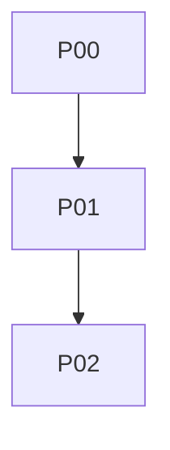

# PLAN.md Template

Write `plans/<YYYY-MM-DD-slug>/PLAN.md`. Replace placeholders. Omit sections that do not apply. Do not leave angle-bracket stubs. This file is the **mission + graph + index**. Full recipes may live here or in `phases/` per [plan-pack.md](plan-pack.md).

```markdown
# <Mission title>

## Metadata

- **Folder:** `plans/<YYYY-MM-DD-slug>/`
- **Created:** <YYYY-MM-DD>
- **Kind:** feature | fix | migrate | extract | delete | infra | spike
- **Pack:** `STATUS.md` · `TRACE.md` · `CONTRACT.md` · `EXECUTION.md` · <phases/ or "inline">
- **Requester:** <user or unspecified>
- **Codebase:** <repo>
- **Branch assumption:** <branch or current workspace>
- **Related:** `<path>` — <why> (or none)
- **Supersedes:** `<path>` (or none)

## Mission

<2–5 sentences. What will be true when the last phase is done.>

## Goals

- <Testable goal>

## Non-goals

- <Out of scope on purpose>

## Success criteria

Map 1:1 into the verification matrix.

- <Observable: API, UI, test, metric, command>

## Assumptions

| ID | Assumption | Why needed | Blast if wrong | Absorbed in |
| --- | --- | --- | --- | --- |
| A1 | | | | P0x |

## Current state

Cite paths. No imagined system.

- **Behavior now:**
- **Entrypoints:** `<path>` — <role>
- **Types / schema:** `<path>` — <shape>
- **UI / routes:** `<path>`
- **Tests:** `<path>` — <already covered>
- **Canonical sibling to copy:** `<path>` — <why>
- **Dead / dual paths to avoid:** `<path>` — <why>
- **Gaps:** <evidence>

## Target state

Name new/changed files, types, routes, jobs, flags, and user-visible behavior. Must match `CONTRACT.md`.

## Work graph



- **Critical path:** P00 → …
- **Lanes:** `main` <plus others only if disjoint>
- **Parallelism rule:** <none | lanes X and Y after P0n>

## Decisions

Do not re-litigate unless the user overrides.

| ID | Topic | Choice | Why | Rejected |
| --- | --- | --- | --- | --- |
| D1 | | | | |

## Constraints

Stack, compatibility, perf, a11y, i18n, security, privacy, licensing, rollout windows.

## Blast radius

- **In scope:** <apps/packages/modules>
- **Callers that must keep working:** `<path>`
- **Generated / vendor / do-not-touch:** `<path>`

## File map

| Path | Action | Phase | Lane | Why |
| --- | --- | --- | --- | --- |
| `<path>` | create \| modify \| delete \| do-not-touch | P0x | main | |

Every modify/delete path must appear in `TRACE.md` as inspected (or be created earlier in the graph).

## Resources

### Load first (implementing agent)

1. `EXECUTION.md`
2. `STATUS.md`
3. this file
4. `CONTRACT.md`
5. current phase body
6. `TRACE.md` if a claim looks wrong

### Internal

- `<path>` — <takeaway>

### External

- <Title> — <URL> — <version or date> — <exact takeaway the plan relies on>

### Commands (repo-real)

- `<exact command>` — <when>

## Architecture

Enough to implement without redesign: data flow, ownership, composition, persistence, flags, env **names**, error/empty states. Use mermaid when sequence or tenancy matters.

Pointer: details that are contracts belong in `CONTRACT.md`, not only here.

## Phase index

| ID | Name | Kind | Lane | Depends on | Unlock | Body |
| --- | --- | --- | --- | --- | --- | --- |
| P00 | | discover/implement/migrate/verify/cleanup | main | — | P01 | inline or `phases/P00-*.md` |

<!-- If inline, paste each phase using the phase template fields immediately below. If split, stop after the index and one-line objective per phase. -->

## Verification matrix

| ID | Criterion | Phase | Command or test | Expected |
| --- | --- | --- | --- | --- |
| V1 | | P0x | `<cmd>` or `<file>::case` | |

## Rollout

Migration, backfill, flag, deploy order, monitoring. If a single merge is enough, say so.

## Security and privacy

Authz, PII, tenancy, injection, secret **names**. If N/A, one line why.

## What not to do

- <Forbidden refactor, drive-by lint, extra apps, expanding scope>

## Open questions

| ID | Question | Default | If wrong | Owner phase |
| --- | --- | --- | --- | --- |
| Q1 | | | | |

## Resume

Follow `EXECUTION.md`. Start at the first phase in `STATUS.md` that is not done. Do not skip verification matrix rows for that phase.
```
